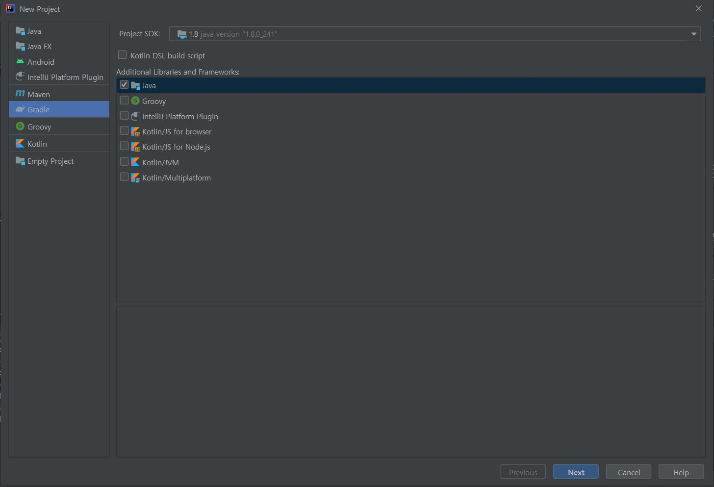
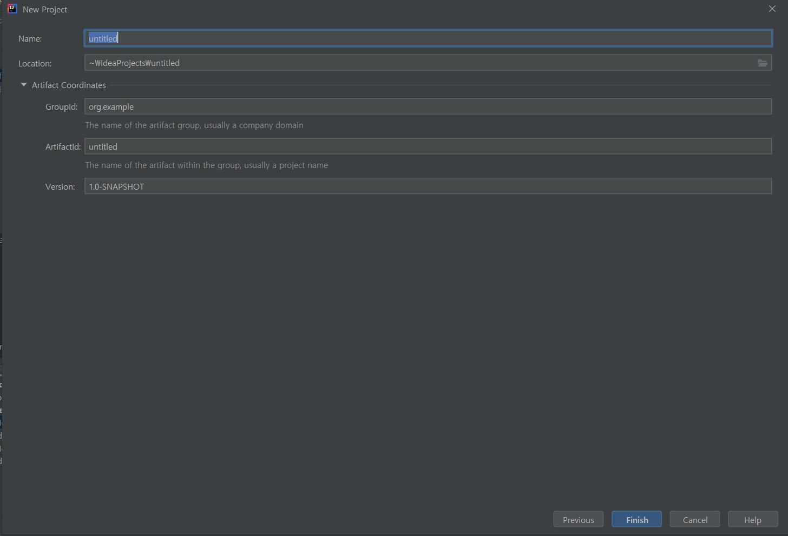

01장 인텔리제이로 스프링 부트 시작하기
================================

인텔리제이 소개
---------------

이클립스보다 인텔리제이가 갖는 강점
- 강력한 추천 기능
- 훨씬 더 다양한 리팩토리과 디버깅 기능
- 이클립스의 깃(Git)에 비해 훨씬 높은 자유도
- 프로젝트 시작할 때 인덱싱을 하여 파일을 비롯한 자원들에 대한 빠른 검색 속도
- HTML과 CSS, JS, XML에 대한 강력한 기능 지원
- 자바, 스프링 부트 버전업에 맞춘 빠른 업데이트


인텔리제이 설치하기
----------------
1. 인텔리제이 다운로드 [https://www.jetbrains.com/ko-kr/idea/download/#section=windows](https://www.jetbrains.com/ko-kr/idea/download/#section=windows)
2. 원하는 테마 설정
3. 단축키, 플러그인 기본값으로 설정

인텔리제이 커뮤니티에서 프로젝트 생성하기
----------------------------------
1. Create New Project
2. Gradle, java 선택 후 Next

3. GroupId, ArtifactId 입력
    - GroupId : src/main/java/(입력한 경로) ex) com.spr.bt
    - ArtifactId : 기본적으로는 프로젝트 이름이 됨


그레이들 프로젝트를 스프링 부트 프로젝트로 변경하기
------------------------------------------
build.gradle 가장 기초적인 설정
```gradle
// 프로젝트의 플러그인 의존성 관리를 위한 설정 (인텔리제이의 플러그인 관리 X)
buildscript {
    ext { // build.gradle에서 사용하는 전역변수를 설정하겠다는 의미

        springBootVersion = '2.1.7.RELEASE'
        // springBootVersion를 생성하고 그 값을 '2.1.7.RELEASE'로 선언
  
    }

    repositories { // 각종 의존성(라이브러리)들을 어떤 원격 저장소에서 받을지를 정함

        mavenCentral() // 기본적으로 많이 사용, 본인이 만든 라이브러리를 업로드하기 위해서는 많은 과정과 설정이 필요
        jcenter()
        /* mavenCentral의 라이브러리 업로드 난이도 때문에 jcenter도 많이 사용,
           라이브러리 업로드가 간단하고 mavenCentral에도 업로드될 수 있도록 자동화 가능 */

    }

    dependencies { 
        classpath("org.springframework.boot:spring-boot-gradle-plugin:${springBootVersion}")
    }

}

// 앞서 선언한 플로그인 의존성들을 적용할 것인지를 결정하는 코드
apply plugin: 'java'
apply plugin: 'eclipse'
apply plugin: 'org.springframework.boot'
apply plugin: 'io.spring.dependency-management'
//io.spring.dependency-management 플러그인은 스프링 부트의 의존성들을 관리해주는 플러그인이라 꼭 추가해야됨

group 'org.spr.bt'
version '1.0-SNAPSHOT'

sourceCompatibility = 1.8

repositories {
    mavenCentral()
}

dependencies { // 프로젝트 개발에 필요한 의존성을 선언하는 곳
    // 버전을 명시하지 않아야만 맨 위에 작성한 버전을 따라가게 됨
    compile('org.springframework.boot:spring-boot-starter-web')
    testCompile('org.springframework.boot:spring-boot-starter-test')
}
```


인텔리제이에서 깃과 깃허브 사용하기
-----------------------------
1. 검색창 단축키<br>
   > windows : [ Ctrl + Shift + A ]<br>
     mac : [ Command + Shift + A ]
2. share project on github 검색
3. 깃허브 로그인
4. 깃허브 프로젝트 생성
    - Repository name 필드에 등록한 이름으로 깃허브에 저장소가 생성
    - [share] 버튼을 클릭하면 깃허브 저장소와 동기화 진행
    - 동기화 과정에서 커밋 항목으로 추가할 것인지 묻는 안내문이 나올 수 있는데 처음에는 [No] 선택
5. 커밋을 위한 팝업창이 나오면 .idea 체크 해제
    - 인텔리제이에서 프로젝트 실행 시 자동으로 생성되는 파일들이기 때문에 깃허브에 올리기 불필요
6. commit, push 후 깃허브 확인
    - commit 단축키<br>
      > windows : [ Ctrl + k ]<br>
        mac : [ Command + k ]<br>
    - push 단축키<br>
      > windows : [ Ctrl + Shift + k ]<br>
        mac : [ Command + Shift + k ]<br>
7. 모든 커밋 대상에서 제외되도록 처리를 위한 .gitignore 추가
    - 검색창에 plugins 검색
    - .ignore 검색 후 install 후 재실행
    - 프로젝트 우클릭 후 New > .ignore file > gitignore file(Git)
    ```
    .gradle
    .idea
    ```