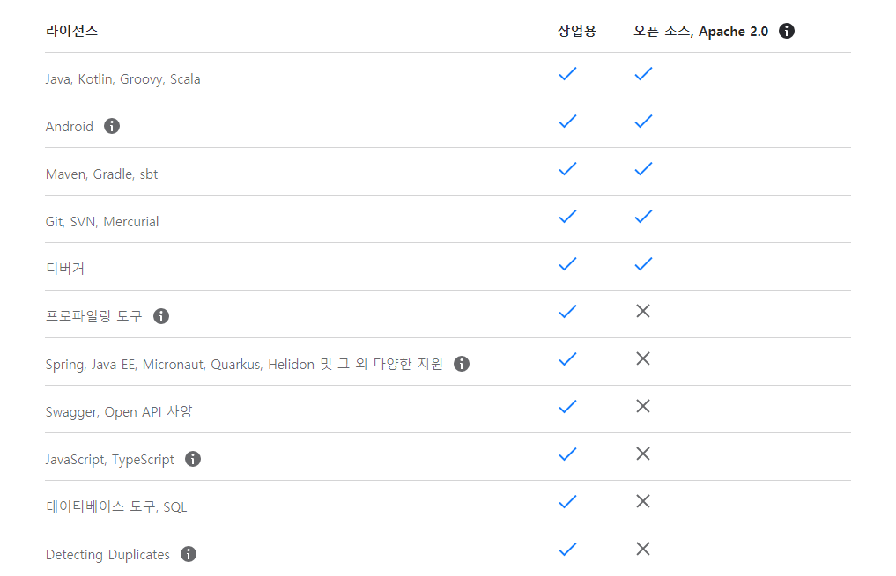

01장 인텔리제이로 스프링 부트 시작하기
================================

인텔리제이 소개
---------------

이클립스보다 인텔리제이가 갖는 강점
- 강력한 추천 기능
- 훨씬 더 다양한 리팩토리과 디버깅 기능
- 이클립스의 깃(Git)에 비해 훨씬 높은 자유도
- 프로젝트 시작할 때 인덱싱을 하여 파일을 비롯한 자원들에 대한 빠른 검색 속도
- HTML과 CSS, JS, XML에 대한 강력한 기능 지원
- 자바, 스프링 부트 버전업에 맞춘 빠른 업데이트

</img> 
